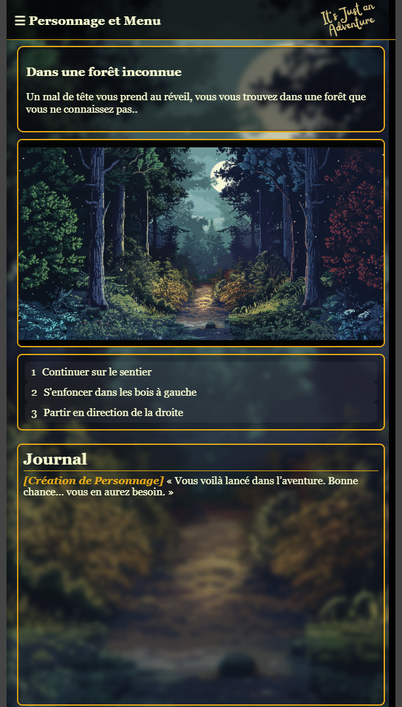

=====================================
                🕵️‍♂️ It's Just An Adventure (Version Beta 0.2) par MADCARAK
=====================================

## 💡 Aperçu visuel

<table>
  <tr>
    <td align="center">
      <h4>🖥️ Version PC</h4>
      
    </td>
    <td align="center">
      <h4>📱 Version Mobile</h4>
      
    </td>
  </tr>
</table>

=====================================
** 🎮 DESCRIPTION **
=====================================
**It's Just An Adventure** est un jeu de rôle textuel (JDR) basé sur la thématique de la ** folie **.  
Plongez dans une aventure captivante où chaque choix compte. Accompagné par des textes immersifs, 
la santé mentale de votre personnage aura un impact direct sur l'expérience du jeu, vous ne vivrait 
pas la même aventure !

Le projet a été imaginé et entièrement réalisé par ** MADCARAK ** en JavaScript/HTML/CSS. 💻 avec 
l'aide de ChatGPT 5.2 sur mammouth.ai et les images sont réalisées à partir de Midjourney 6.1.

=====================================
** ✨ PRINCIPALES FONCTIONNALITÉS **
=====================================
- Un ** système de narration dynamique ** : vos choix influencent l'histoire.
- Un ** univers oppressant ** : explorez une aventure dans un univers de Dark Fantasy où la 
** folie ** n'est jamais loin.
- ** Interface minimaliste ** pensée pour une immersion totale.
- Prise en charge sur Linux, MAC et PC via une interface Web et une version mobile (APK Android) 

=====================================
** DERNIERE MISE A JOUR **
=====================================
12/02/2026 :
- Lancement du dépôt sur GitHub
- Création du side-menu pour la version mobile
- Zone disponible complète : La Forêt
- Zone en construction : La Montagne

=====================================
** ⚙️ INSTALLATION **
=====================================
** Prérequis : **
- Un navigateur Web récent (Chrome, Firefox ou Edge recommandés).
- APK : Téléphone mobile sous Android 13

** Lancer le jeu : **
- Accédez au repository de Github :  
   🕸️ ** [   Github : https://github.com/Madcarak/ItsJustAnAdventure_APK   ] ** 
 
- Clonez le projet et exécutez le localement à partir de ** cmd.exe ** ou ** powershell ** sous Windows :

Rendez-vous dans le dossier de votre choix pour l'installation et copiez-collez les 4 commandes ci-dessous :
-----------------------------------------------------------------------------------------------------

git clone git@github.com:Madcarak/ItsJustAnAdventure_APK.git

cd ItsJustAnAdventure_APK

cd www

start index.html

-----------------------------------------------------------------------------------------------------
** APK android ** disponible en version debug à cette emplacement en local :
-----------------------------------------------------------------------------------------------------

~\ItsJustAnAdventure_APK\android\app\build\outputs\apk\debug\app-debug.apk

-----------------------------------------------------------------------------------------------------

=====================================
** AUTRES INFORMATIONS **
=====================================

- ** ⚠️ Notes importantes ** : Jeu fonctionnel en version démo
- ** 🌐 Langues prises en charge ** : Français uniquement actuellement.

=====================================
🕵️‍♂️ It's Just An Adventure (Version Beta 0.2) par MADCARAK
=====================================
Auteur : Madcarak (Laurent Aubouy)  
Contact : aubouy.laurent@gmail.com  
GitHub : Madcarak
=====================================

## 💡 Galerie des visuels (PC et Mobile)

  Cliquez sur une image pour l'agrandir 👇

  <!-- Colonne PC -->
  

    <h4>🖥️ Visuels PC</h4>
    
    
    
    
    
    
    
    
  

  <!-- Colonne Mobile -->
  

    <h4>📱 Visuels Mobile</h4>
    
    
    
    
    
    
    
    
    
  

